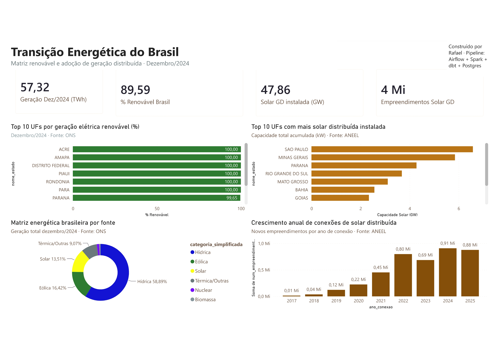

# 🔋 Pipeline de Dados — Transição Energética do Brasil

Pipeline end-to-end de Engenharia de Dados que processa **+5 milhões de registros** de fontes públicas (ONS e ANEEL) para analisar a transição energética brasileira: matriz elétrica renovável e explosão da solar distribuída.



---

## 📊 Principais Insights

| Métrica | Valor |
|---------|-------|
| Geração total (Dez/2024) | 57,32 TWh |
| % Renovável Brasil | **89,59%** |
| Solar GD instalada | 47,86 GW |
| Empreendimentos solares | 4 milhões |
| UFs com 100% renovável | 6 (AC, AP, DF, PI, RO, PA) |
| Crescimento solar 2017→2024 | **~90x** |

**Tese central:** Existem dois Brasis na transição energética — Norte/Nordeste lidera a matriz limpa centralizada, enquanto Sudeste/Sul lidera a adoção de solar distribuída nos telhados.

---

## 🏗️ Arquitetura

```
┌─────────────────────────────────────────────────────────────┐
│                    FONTES PÚBLICAS                           │
│   ONS (API CKAN) ─ geração horária SIN                      │
│   ANEEL (CSV) ─ cadastro MMGD geração distribuída           │
└──────────────────────────┬──────────────────────────────────┘
                           ↓
┌──────────────────────────────────────────────────────────────┐
│  BRONZE (raw)         MinIO S3 · Airflow DAGs                │
│  CSV particionado por data no data lake                      │
└──────────────────────────┬───────────────────────────────────┘
                           ↓
┌──────────────────────────────────────────────────────────────┐
│  SILVER (limpo)       PySpark via docker exec                │
│  Parquet+Snappy · Schema tipado · Drop PII · Compressão 16x │
└──────────────────────────┬───────────────────────────────────┘
                           ↓
┌──────────────────────────────────────────────────────────────┐
│  WAREHOUSE            DuckDB → PostgreSQL                    │
│  Ponte Parquet→SQL · Schema "raw" no Postgres                │
└──────────────────────────┬───────────────────────────────────┘
                           ↓
┌──────────────────────────────────────────────────────────────┐
│  GOLD (marts)         dbt-postgres · 6 models · 23 testes    │
│  dim_uf · dim_fonte · fact_geracao · fact_capacidade         │
└──────────────────────────┬───────────────────────────────────┘
                           ↓
┌──────────────────────────────────────────────────────────────┐
│  CONSUMO              Power BI Desktop                       │
│            4 KPIs · 4 gráficos · 3 slicers ·    │
└──────────────────────────────────────────────────────────────┘
```

**Stack completa:** Apache Airflow · Apache Spark · MinIO · PostgreSQL · dbt · DuckDB · Power BI · Docker Compose

---

## 🐳 Infraestrutura (10 containers)

| Container | Função | Porta externa |
|-----------|--------|---------------|
| `airflow-webserver` | UI do Airflow | `8080` |
| `airflow-scheduler` | Orquestração + docker CLI | — |
| `spark-master` | Spark master node | `8081` |
| `spark-worker` | Spark worker (1.5GB RAM, 2 cores) | — |
| `minio` | Data lake S3-compatible | `9000` / `9001` |
| `postgres-airflow` | Metadata do Airflow | — |
| `postgres-warehouse` | Data warehouse analítico | `5433` |
| `dbt` | Container dedicado dbt-postgres | — |
| `minio-init` | Cria buckets bronze/silver/gold | — |
| `airflow-init` | Migra DB + cria user admin | — |

---

## 📁 Estrutura do Projeto

```
energia-brasil-pipeline/
├── airflow/
│   └── dags/
│       ├── ons_geracao_horaria_bronze.py     # Ingestão ONS → MinIO
│       ├── aneel_mmgd_bronze.py              # Ingestão ANEEL → MinIO
│       ├── silver_ons_processing.py          # Spark: bronze → silver ONS
│       ├── silver_aneel_processing.py        # Spark: bronze → silver ANEEL
│       ├── load_silver_to_warehouse.py       # DuckDB: Parquet → Postgres
│       └── dbt_build.py                      # dbt build via docker exec
├── spark/
│   └── jobs/
│       ├── silver_ons.py                     # Job PySpark ONS
│       └── silver_aneel.py                   # Job PySpark ANEEL
├── dbt/
│   ├── dbt_project.yml
│   ├── profiles.yml
│   └── models/
│       ├── sources.yml
│       ├── staging/
│       │   ├── stg_ons_geracao_horaria.sql
│       │   ├── stg_aneel_mmgd.sql
│       │   └── _staging__models.yml
│       └── marts/
│           ├── dim_uf.sql
│           ├── dim_fonte_energia.sql
│           ├── fact_geracao_mensal.sql
│           ├── fact_capacidade_distribuida.sql
│           └── _marts__models.yml
├── powerbi/
│   └── dashboard-energia-brasil.pbix
├── docs/
│   └── dashboard-preview.jpg
├── docker-compose.yml
├── .env
└── README.md
```

---

## 🔄 DAGs do Airflow (6 no total)

| DAG | Camada | Função | Tempo |
|-----|--------|--------|-------|
| `ons_geracao_horaria_bronze` | Bronze | API CKAN → CSV → MinIO | ~2 min |
| `aneel_mmgd_bronze` | Bronze | Download MMGD → MinIO | ~5 min |
| `silver_ons_processing` | Silver | PySpark: CSV → Parquet | 54s |
| `silver_aneel_processing` | Silver | PySpark: 1.4GB CSV → Parquet | 2 min |
| `load_silver_to_warehouse` | Warehouse | DuckDB: Parquet → Postgres | ~2 min |
| `dbt_build` | Gold | dbt build (models + tests) | ~30s |

**Execução sequencial recomendada:** Bronze → Silver → Warehouse → dbt

---

## 🧪 Modelagem Dimensional (dbt)

**Projeto dbt:** 6 models, 23 testes automáticos, lineage completo.

### Dimensões
- **`dim_uf`** (28 linhas) — Estados brasileiros com subsistema elétrico
- **`dim_fonte_energia`** (12 linhas) — Fontes classificadas: Hídrica, Eólica, Solar, Nuclear, Biomassa, Térmica

### Fatos
- **`fact_geracao_mensal`** (138 linhas) — Geração por UF/mês/fonte com % renovável
- **`fact_capacidade_distribuida`** (19.896 linhas) — Capacidade GD por UF/mês/fonte/classe

### Testes de qualidade
- `not_null` em chaves primárias e métricas críticas
- `unique` em dimensões (garante 1 linha por UF)
- `accepted_values` em categorias de fonte
- `relationships` entre fatos e dimensões (integridade referencial)

---

## 🚀 Como executar

### Pré-requisitos
- Docker Desktop (com Docker Compose v2)
- 16GB RAM recomendado (stack usa ~5-6GB)
- 20GB de disco livre
- Power BI Desktop (para visualização)

### Passo a passo

```bash
# 1. Clone o repositório
git clone https://github.com/RafaelTomiazi/energia-brasil-pipeline.git
cd energia-brasil-pipeline

# 2. Suba a infraestrutura (10 containers)
docker compose up -d

# 3. Aguarde 3-5 minutos (scheduler instala dependências no boot)
# Acompanhe com: docker compose logs airflow-scheduler --follow

# 4. Acesse o Airflow
# http://localhost:8080 (admin / admin)

# 5. Execute os DAGs na ordem:
#    1) ons_geracao_horaria_bronze
#    2) aneel_mmgd_bronze
#    3) silver_ons_processing
#    4) silver_aneel_processing
#    5) load_silver_to_warehouse
#    6) dbt_build

# 6. Valide os dados no warehouse
docker exec postgres-warehouse psql -U warehouse -d energia \
  -c "SELECT sigla_uf, ROUND(SUM(geracao_total_mwh)::numeric, 0) AS total_mwh, \
      ROUND((SUM(geracao_renovavel_mwh)::numeric / NULLIF(SUM(geracao_total_mwh)::numeric, 0)) * 100, 1) AS pct_renovavel \
      FROM public_marts.fact_geracao_mensal GROUP BY sigla_uf ORDER BY pct_renovavel DESC LIMIT 10;"

# 7. Abra o dashboard no Power BI Desktop
#    powerbi/dashboard-energia-brasil.pbix
```

### Portas dos serviços

| Serviço | URL |
|---------|-----|
| Airflow UI | http://localhost:8080 |
| MinIO Console | http://localhost:9001 |
| Spark UI | http://localhost:8081 |
| Postgres Warehouse | `localhost:5433` (user: warehouse, db: energia) |

---

## 📈 Dashboard

O dashboard conecta diretamente no `postgres-warehouse` (porta 5433) e apresenta:

- **4 KPIs:** Geração total, % renovável, solar GD instalada, empreendimentos
- **Top 10 UFs por % renovável** — barras verdes com gradiente
- **Top 10 UFs por solar GD em GW** — barras laranja
- **Matriz energética por fonte** — donut chart (Hídrica 59%, Eólica 16%, Solar 13%)
- **Crescimento anual solar** — barras verticais 2017→2025 (explosão ~90x)
- **3 slicers interativos** — filtro por ano, fonte e UF
- **Tema JSON customizado** — fundo cinza, cartões flutuando, tipografia Segoe UI

---

## 🧠 Decisões técnicas e lições aprendidas

**Spark no Airflow via `docker exec`:** A imagem oficial do Airflow não inclui JVM. Em vez de instalar Java no container (200MB, lento), usamos `BashOperator` + `docker exec spark-master spark-submit`. Cada ferramenta no seu container — padrão que em produção seria `KubernetesPodOperator`.

**dbt em container dedicado:** `dbt-postgres` conflitava com dependências do Airflow (`ResolutionTooDeep`). Solução: container separado com imagem oficial `ghcr.io/dbt-labs/dbt-postgres:1.8.2` em `sleep infinity`, chamado via `docker exec`.

**DuckDB como ponte Parquet→Postgres:** DuckDB lê Parquet do S3 nativamente e grava em Postgres via extensão. Em ~30 linhas de Python, substitui o que seriam centenas com pandas + SQLAlchemy.

**Testes dbt detectaram bugs reais:** 2 registros ANEEL com `sigla_uf` NULL e 4 duplicatas em `dim_uf` — encontrados automaticamente pelos 23 testes, corrigidos antes de chegar ao dashboard.

---

## 📂 Fontes de Dados

| Fonte | Órgão | Descrição | Volume |
|-------|-------|-----------|--------|
| Geração horária SIN | ONS | Produção por usina/hora/subsistema | 519.696 linhas |
| MMGD | ANEEL | Cadastro de geração distribuída | ~5M registros |

---

## 🛠️ Stack Tecnológica

| Categoria | Ferramenta |
|-----------|-----------|
| Orquestração | Apache Airflow 2.10.5 |
| Processamento | Apache Spark 3.5.3 (PySpark) |
| Data Lake | MinIO (S3-compatible) |
| Warehouse | PostgreSQL 15 |
| Transformação | dbt-postgres 1.8.2 |
| Ponte de dados | DuckDB 1.1.3 |
| Visualização | Power BI Desktop |
| Infraestrutura | Docker Compose (10 containers) |
| Linguagens | Python, SQL, DAX |

---

## 👤 Autor

**Rafael** — Estudante de Engenharia de Software (Unoeste) e Ciência de Dados/IA (Infnet). Em transição para Engenharia de Dados.

[]

---

## 📝 Licença

Este projeto é open source para fins educacionais. Os dados utilizados são públicos (ONS e ANEEL).
